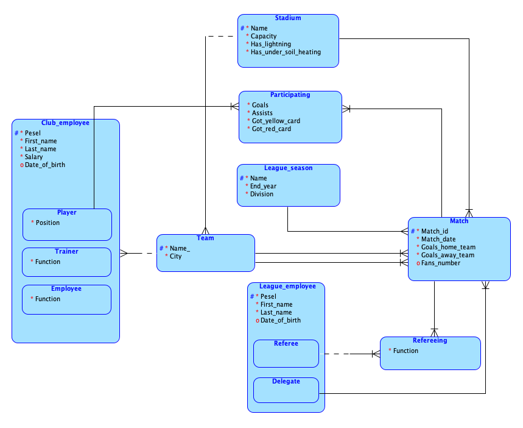

<h1 align="center">
    Football-Database ⚽️
</h1>

_Also available in: [Polski](README.pl.md)_

## About

Football-Database project for Database Systems at Poznan University of Technology. The application allows managing a database of various football leagues which entity relationship diagram is shown below:    



The main goal of this project was to implement [java](https://www.java.com/) [spring](https://spring.io/) web application that connects to database using [JPA](https://spring.io/projects/spring-data-jpa) and allows user to add, modify or delete data from database. Additionally, GUI was implemented using [Vaadin](https://vaadin.com/) template. All the required [SQL scripts](src/main/resources/META-INF/resources/sql/schema.sql) to create tables can be found in resources folder. 

## Folder Structure
```bash
PROJECT_FOLDER
│  README.md
│  README.pl.md
│  pom.xml
└──[frontend]   
│  └──[themes] # Contains the custom CSS styles.
└──[src]      
   └──[main]      
      └──[java]      
      └──[resources]
         │  application.properties # Contains springboot configurations and database connection
         └──[META-INF]
            └──[resources] 
               └──[sql]
                  │  schema.sql    # Contains DB Script to create tables         
                  └──data.sql      # Contains DB Script to insert data (after schema.sql)
```

## Running the application

The application has to be connected to database, that's why you need first to configure connection parameters to your database in [application.properties](src/main/resources/application.properties) file and run [SQL schema script](src/main/resources/META-INF/resources/sql/schema.sql) in this database to create required tables. You can also insert some already prepared sample data using [SQL data script](src/main/resources/META-INF/resources/sql/schema.sql).

The project is a standard Maven project. To run it from the command line,
type `mvnw` (Windows), or `./mvnw` (Mac & Linux), and then open
http://localhost:8080 in your browser to see the application.

You can also import the project to your IDE of choice as you would with any
Maven project.
