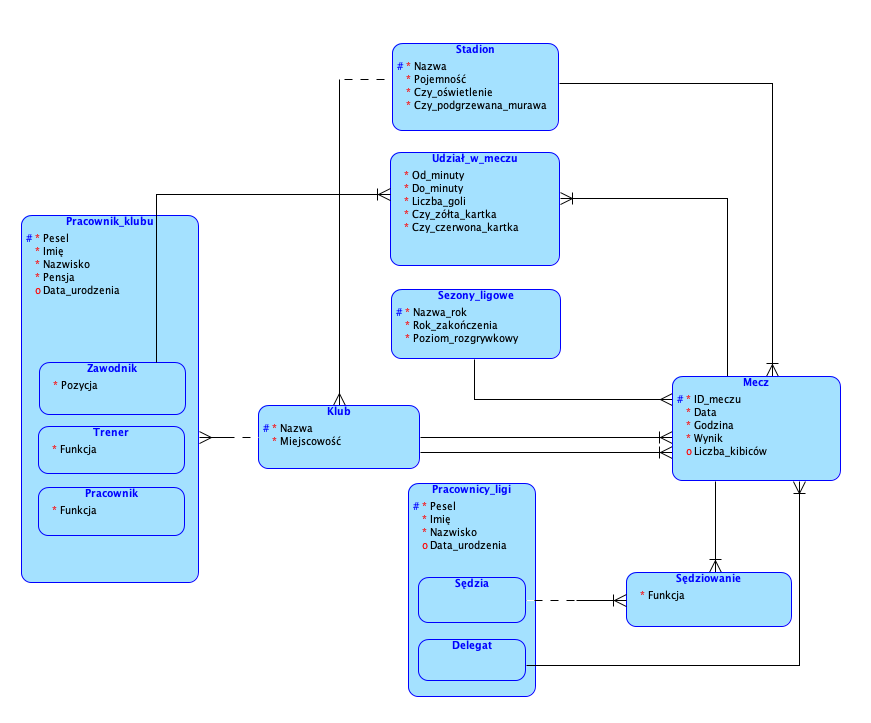

<h1 align="center">
    Piłkarska Baza Danych ⚽️
</h1>

_Dostępne również w wersji po: [English](README.md)_

## O projekcie

Piłkarska Baza Danych - projekt w ramach przedmiotu Zarządzanie Bazami SQL i NoSQL na Politechnice Poznańskiej. Aplikacja pozwala na zarządzanie piłkarską bazą danych różnych lig piłkarskich, której schemat przedstawiono poniżej:




Celem projektu było zaimplementowanie aplikacji internetowej [java](https://www.java.com/) [spring](https://spring.io/) łączącej się z bazą danych przy pomocy [JPA](https://spring.io/projects/spring-data-jpa) i pozwalającej użytkownikowi na dodwanie, modyfikacje i usuwanie danych z bazy. Dodatkowo GUI zostało zaimplementowane przy pomocy szkieletu [Vaadin](https://vaadin.com/). Wszystkie niezbędne [SQL'owe skrypty](src/main/resources/META-INF/resources/sql/schema.sql) znaleźć można w folderze resources.

## Struktura folderu
```bash
PROJECT_FOLDER
│  README.md
│  README.pl.md
│  pom.xml
└──[frontend]   
│  └──[themes] # Contains the custom CSS styles.
└──[src]      
   └──[main]      
      └──[java]      
      └──[resources]
         │  application.properties # Contains springboot configurations and database connection
         └──[META-INF]
            └──[resources] 
               └──[sql]
                  │  schema.sql    # Contains DB Script to create tables         
                  └──data.sql      # Contains DB Script to insert data (after schema.sql)
```

## Uruchamianie aplikacji

Aplikacja wymaga połączenia z bazą danych, dlatego pierwszą czynnością w celu jej uruchomienia powinno być skonfigurowanie parametrów połączeniowych w pliku [application.properties](src/main/resources/application.properties), a następnie uruchomienie [SQL'owego skryptu](src/main/resources/META-INF/resources/sql/schema.sql) zawierającego polecenia tworzące niezbędne do działania elementy bazodanowe. Dodatkowo uruchomić można również [SQL'owy skrpyt](src/main/resources/META-INF/resources/sql/schema.sql) wypełniający bazę przygotowanymi przykładowymi danymi.

Projekt korzysta z Mavena, dlatego w celu uruchomienia go z terminala, wystarczy skorzystać z polecenia
`mvnw` (Windows), lub `./mvnw` (Mac & Linux), a następnie otworzyć w swojej przeglądarce adres http://localhost:8080, na którym aplikacje będzie widoczna.

Możliwe jest również zaimportowanie projektu do IDE według uznania, ponieważ projekt korzysta z Mavena.

## Autorzy

<a href="https://github.com/filipciesielski7/Football-Database/graphs/contributors">
  
</a>
